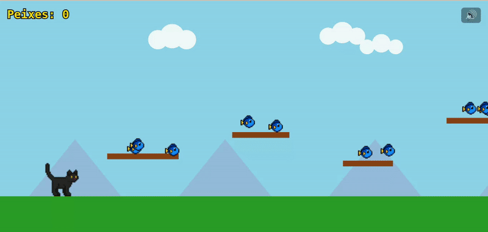

# 🐈‍⬛ Gatinho e Peixinhos

Um joguinho 2D feito em **HTML5 Canvas**, **JavaScript** e **CSS**, onde um gatinho sai em busca de peixinhos dourados que flutuam pelo cenário.  
Projeto criado para explorar animação em canvas, física simples, manipulação de sprites e sons.

---

## 🎮 Demonstração



Ou jogue online pelo GitHub Pages:  
👉 **https://daniele.github.io/jogo_gatinhos/**

---

## 🧱 Tecnologias utilizadas

- **HTML5** → estrutura do jogo  
- **CSS3** → layout e estilo visual  
- **JavaScript (ES6)** → lógica, física, sons e animações  
- **Canvas API** → renderização dos sprites e elementos do cenário  
- **GitHub Pages** → hospedagem gratuita do jogo  

---

## 🖼️ Créditos e Recursos

**Sprites:**
- Gato preto: [CarySaurus - Black Cat Sprites](https://carysaurus.itch.io/black-cat-sprites)  
- Peixinhos: [PixelGnome - Fish Pack](https://pixelgnome.itch.io/fish)

**Sons:**
- Som de coleta: [Pixabay Sound Effects](https://pixabay.com/sound-effects/)  
- Música de fundo: [FreeSound.org](https://freesound.org)

> 🎨 Todos os recursos foram utilizados apenas para fins educacionais e de demonstração.

---

## ⚙️ Como executar o jogo localmente

1. Baixe ou clone o repositório:
   ```bash
   git clone https://github.com/daniele/jogo_gatinhos.git
Abra a pasta do projeto:

bash
Copiar código
cd jogo_gatinhos
Inicie um servidor local (ex: com a extensão Live Server do VSCode)

Abra no navegador em http://localhost:5500 (ou endereço indicado)

🚀 Deploy:
O jogo está publicado via GitHub Pages.
Acesse em:
👉 https://daniele.github.io/jogo_gatinhos/

✨ Créditos:
Desenvolvido por Daniele Rosa 💻
Com muito carinho, café ☕ e amor por gatinhos 🐾

📜 Licença:
Este projeto é de uso livre para fins de estudo.
Os recursos visuais e sonoros pertencem aos seus respectivos autores.
